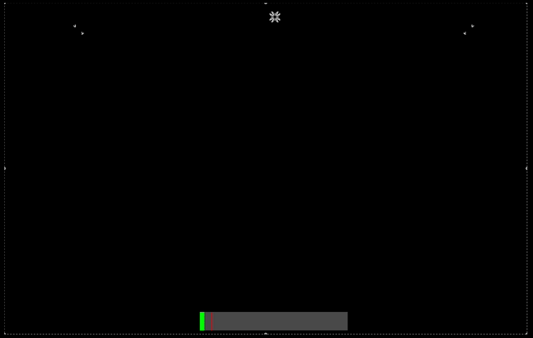

# Microphone Controlled Game of Life

I created this project for an exhibition with live music in April 2024 in Berlin. The goal was to make Conway’s Game of Life interactive and controllable through ambient sounds. I implemented it so that when the sound level exceeds a certain threshold, two gliders are spawned. They move toward the center of the field, where they meet and “collide”. After a while this creates interesting patterns, which makes the grid look almost like some kind of organism. The sound level is not visible to visitors in the exhibition space and is only displayed for demonstration purposes in the video below. This could still be further improved and developed. For example, the system could be extended so that different frequencies or types of sound trigger different events within the Game of Life, so this is more like a prototype.

Fast forwarded demonstration of a simulation. The red line in the level bar is the microphone threshold.

## Configuration

The simulation can be customized through the `config` object:

| Parameter        | Description                                                                             |
| ---------------- | --------------------------------------------------------------------------------------- |
| `cellSize`       | Size of each cell in pixels. Smaller values create a finer grid.                        |
| `threshold`      | Audio level that must be exceeded to spawn gliders.                                     |
| `cooldownPeriod` | Minimum time in milliseconds between glider spawns.                                     |
| `tickInterval`   | Time in milliseconds between simulation steps. Lower values make the simulation faster. |
| `sideMarginPct`  | Distance from the edge at which gliders enter the field, expressed as a percentage.     |
| `aliveColor`     | Color of living cells.                                                                  |
| `deadColor`      | Color of dead cells.                                                                    |
| `spawnGliders`   | Enables or disables audio-triggered glider spawning.                                    |
| `paused`         | Pauses or resumes the simulation.                                                       |
| `seedPattern`    | Pattern used when re-seeding the simulation (e.g. `pulsar`).                            |
